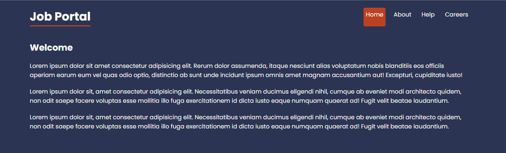
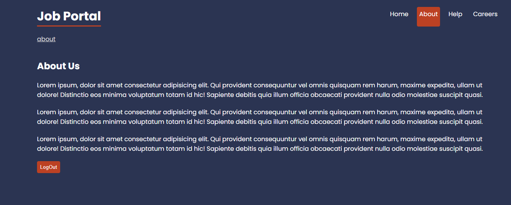
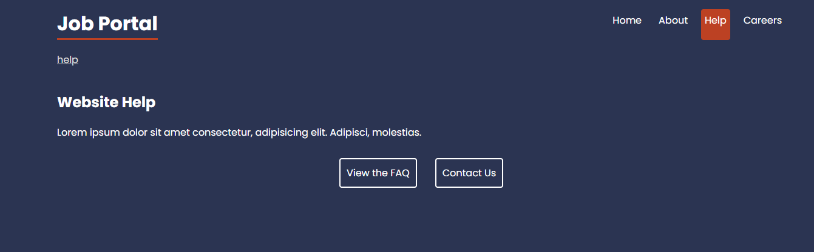
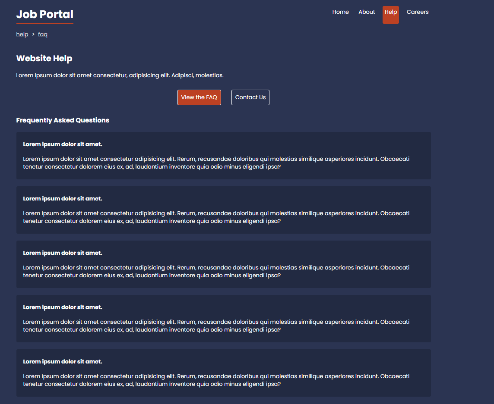
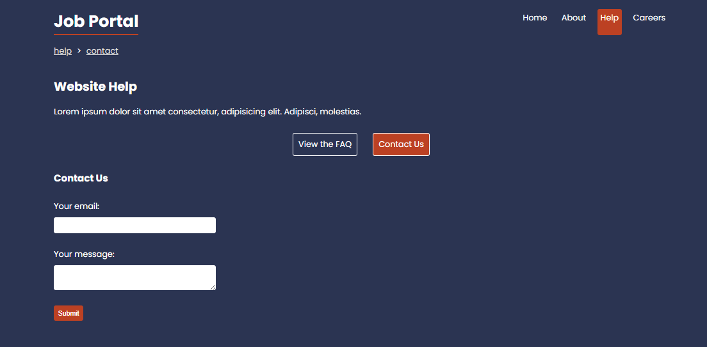
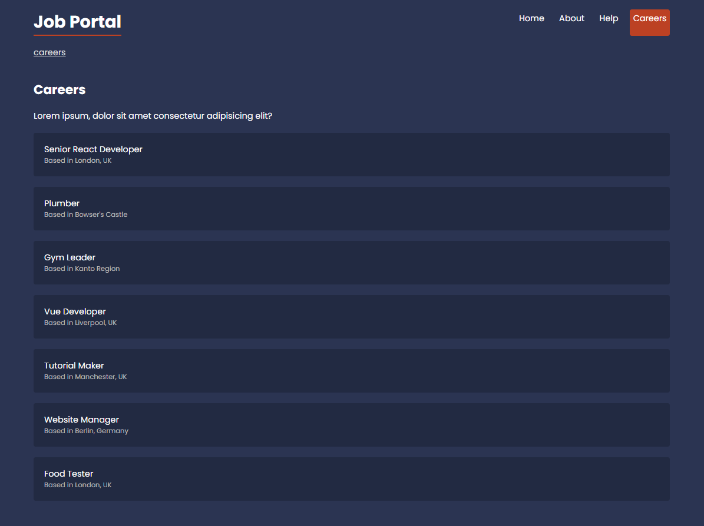
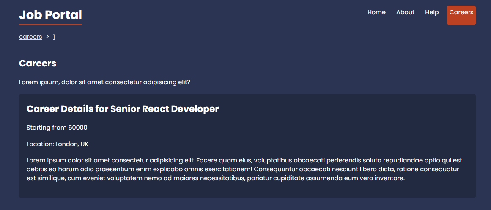

# 💼 Jobs Router

A React project built to deeply practice **React Router v6+** using real-world routing patterns such as loaders, actions, dynamic routes, breadcrumbs, redirects, and full error handling.  
A mock REST API is powered by **JSON-Server**.

---

## 🚀 Features

- **`useLoaderData()`** – Fetch data before rendering UI  
- **`useParams()`** – Access dynamic route parameters  
- **`useRouteError()`** – Handle loader/action/route errors  
- **`useActionData()`** – Receive form submission results  
- **`redirect()`** – Return redirects from actions  
- **`<Navigate />`** – Component-based navigation  
- **`<Form />`** – React Router's native form handling  
- **`throw new Response()`** – API-style error throwing  
- **Breadcrumbs with `useMatches()` + route `handle`**  

---

## 📸 Screenshots

### Home Page


### About Us


### Help


### Faq


### Contact Us


### Career


### Job Post


---

## 🌐 API Layer (JSON-Server)
- Built-in REST API using `json-server`  
- All data loaded through route loaders  
- Custom API **404 handling**  
- Separate UI-level and API-level error pages  

---

## 📄 Pages & Routes
- Home  
- Job List  
- Job Details  
- Edit Job (with action + redirect)  
- Breadcrumb Navigation  
- 404 Not Found Page  
- API Error Page  

---

## 🛠️ Tech Stack
- **React + Vite**  
- **React Router DOM**  
- **Tailwind CSS**  
- **JSON-Server**  

---

## ▶️ Getting Started
1. Install dependencies
   ```bash
   npm install

2. Start the mock API (JSON-Server)
    ```bash
      npx json-server data/db.json --port 4000

3. Run the app
    ```bash
    npm run dev

4. Open in browser
    Visit → http://localhost:5173
